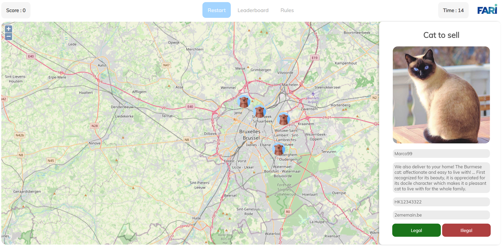
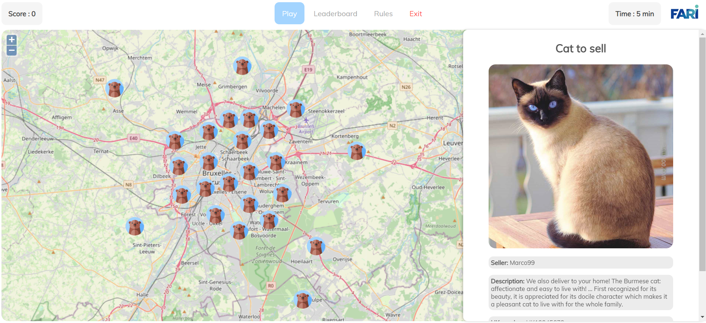

# FARI: Demo for the animal well-being project

## Description
The idea of this project is to explain to a non-expert public the functioning of the AI which classifies online pet sale ads.
To do this, this project takes the form of a game during which the user will confront the AI and other players.

## Play the game
Install:
```
cd FARI - Demo
pip install flask
```
Run:
```
python -m flask --app=app --debug run --host=0.0.0.0
```
Then go to:

http://192.168.0.219:5000/ or to http://127.0.0.1:5000/

## Screenshot



